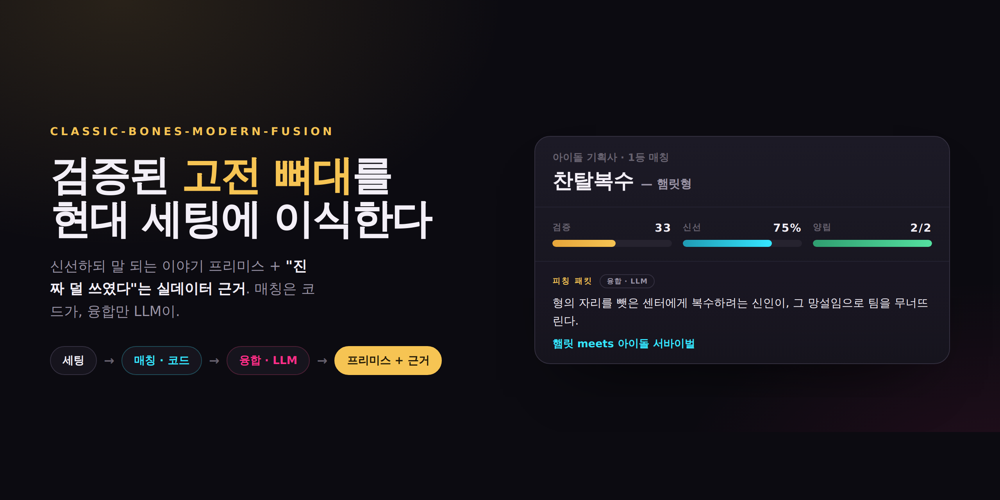
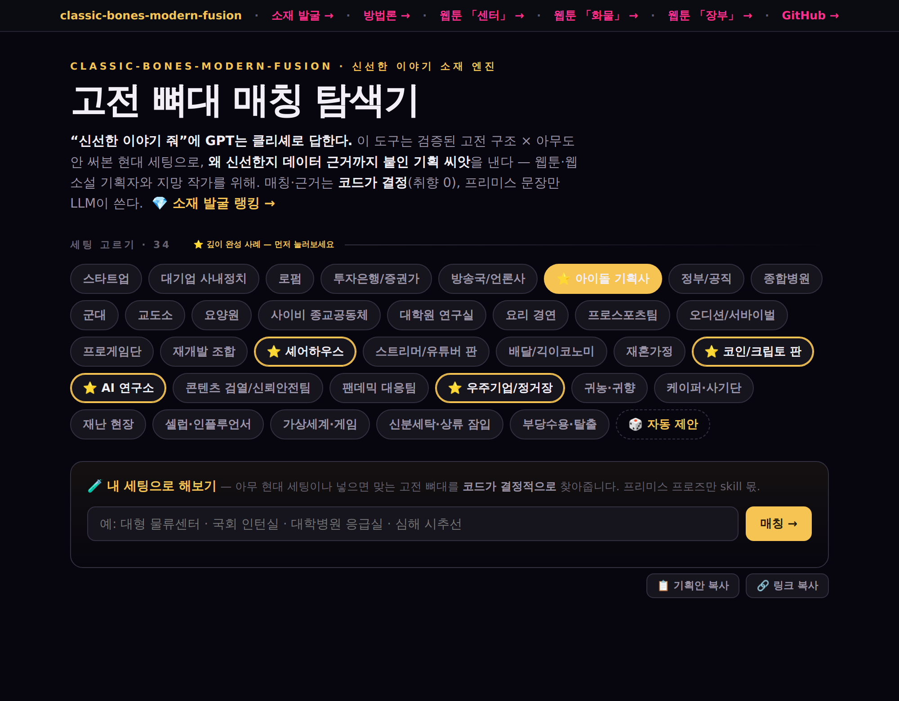
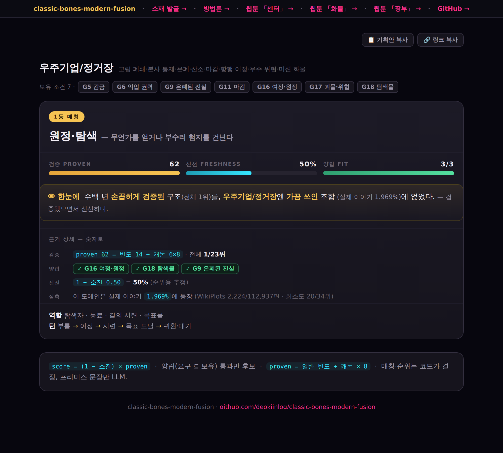
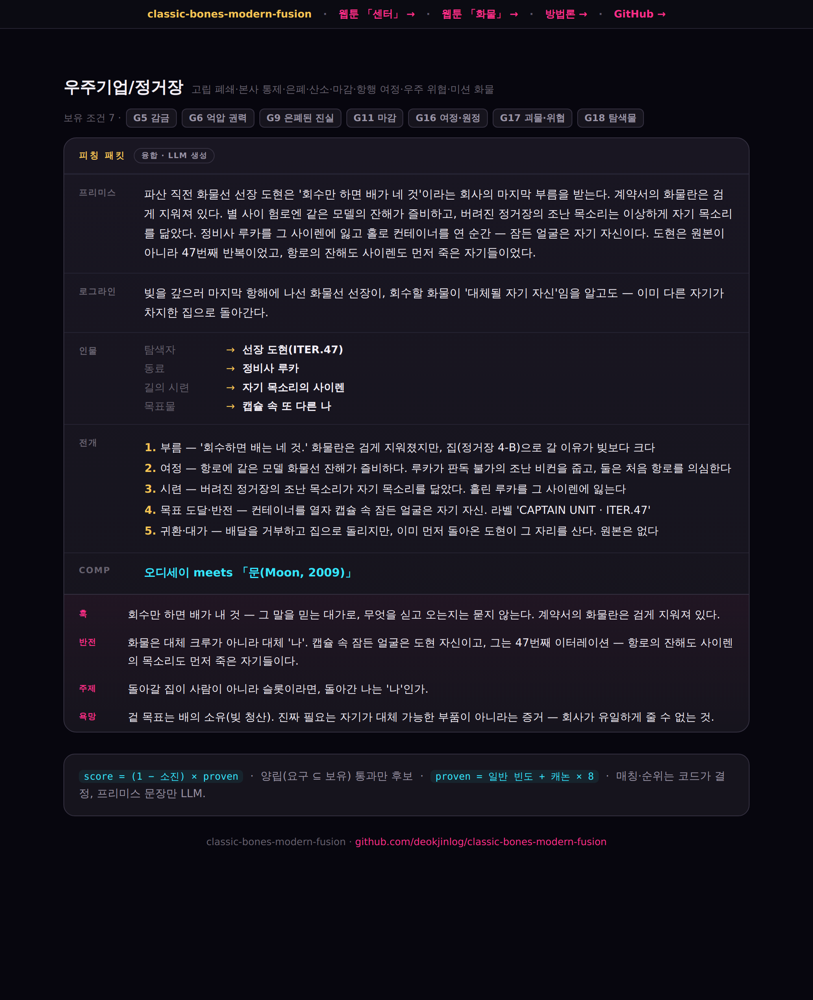
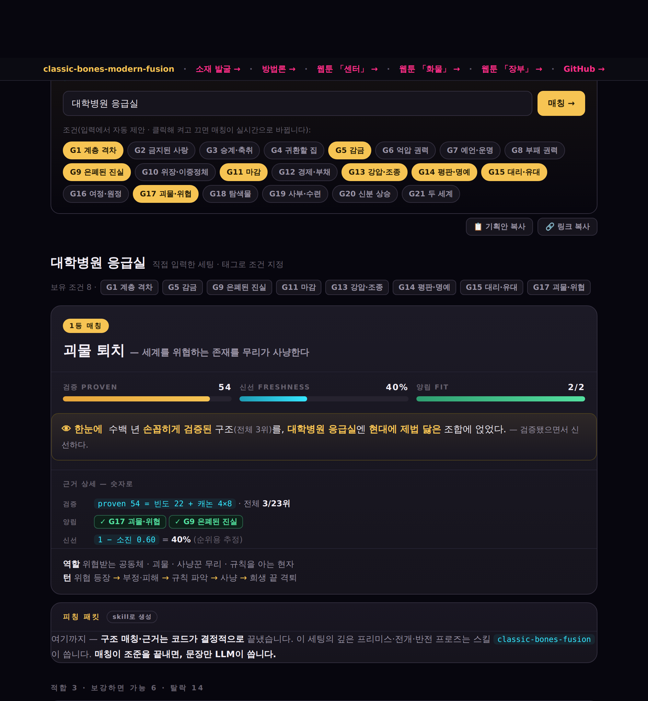
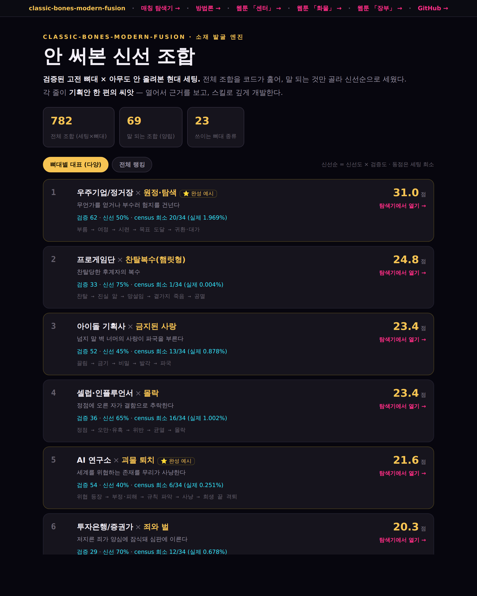
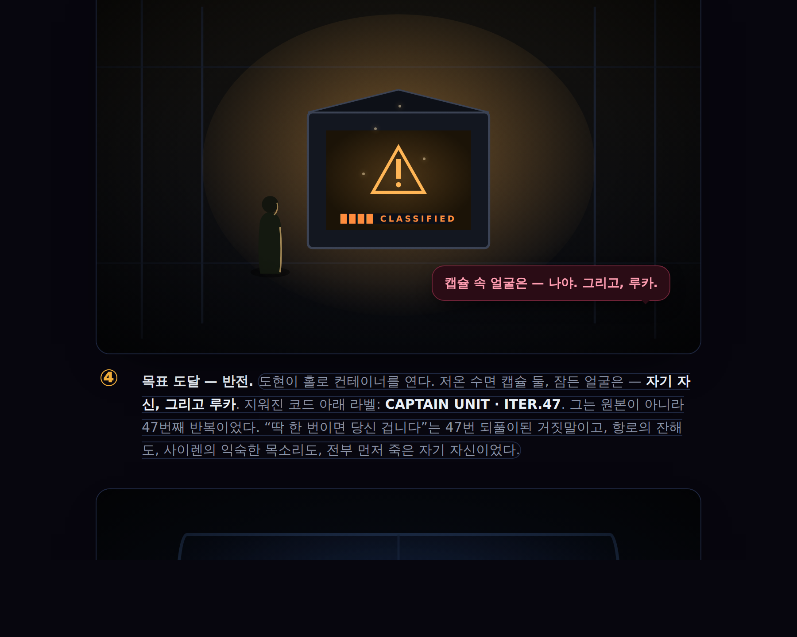

# classic-bones-modern-fusion

[](https://deokjinlog.github.io/classic-bones-modern-fusion/)

> **“신선한 이야기 줘”** 라고 하면 모델은 학습에서 흔한 쪽으로 회귀한다.
> 이 도구는 **수백 년 검증된 고전 구조**를 **아무도 안 써본 현대 세팅**에 이식하고, *왜 신선한지 데이터로 증명*한다.
> 무엇을 쓸지는 **코드가 결정**하고, **문장만 LLM**이 쓴다.
>
> 웹툰·웹소설·드라마 **기획자와 지망 작가**를 위한 — *신선한 이야기 소재 발굴 엔진.*

## 바로 보기 (레포에서 바로 열림)

- 🧭 **매칭 탐색기** (랜딩): <https://deokjinlog.github.io/classic-bones-modern-fusion/>
- 💎 **소재 발굴** (안 써본 신선 조합 랭킹): [discover.html](https://deokjinlog.github.io/classic-bones-modern-fusion/discover.html) — 검증된 구조 × 안 써본 세팅, 신선순으로 세운 기획 씨앗
- 📖 웹툰 「센터」 (햄릿 × 아이돌): [center.html](https://deokjinlog.github.io/classic-bones-modern-fusion/center.html)
- 📖 웹툰 「화물」 (오디세이 × 우주선): [cargo.html](https://deokjinlog.github.io/classic-bones-modern-fusion/cargo.html)
- 📖 웹툰 「장부」 (조사 미스터리 × 코인판): [coin.html](https://deokjinlog.github.io/classic-bones-modern-fusion/coin.html)
- 🛠 **만드는 법** (방법론): [method.html](https://deokjinlog.github.io/classic-bones-modern-fusion/method.html)

---

## 화면으로 보기 — 무엇을, 어떻게 만들었나

### ① 세팅 하나 고르면 → 맞는 고전 뼈대



현대 세팅 34종 중 하나(또는 **⭐ 깊이 완성 사례 5개**)를 고르면, 그 세팅이 **보유한 조건**(G1–G21)과 각 고전 뼈대가 **요구하는 조건**을 코드가 대조해 맞는 구조를 찾는다. `요구 ⊆ 보유` 집합 연산이라 **취향 0 · 재현 가능**.

### ② 근거 — “왜 이 조합인가”를 숫자로



이 도구의 핵심. GPT는 “신선하다”고 *말하지만*, 여기선 **보여준다** — 아무 생성 도구도 이걸 재지 않는다.

- **검증 proven** = 일반 빈도 + 캐논 × 8 — 얼마나 반복돼 살아남은 구조인가 (위: `62 = 14 + 6×8`, 전체 1/23위)
- **실측 census** = WikiPlots **112,937편**에서 이 배경이 몇 편에 나오나 직접 셈 — 희소할수록 미개척
- **양립 FIT** = 요구 n/n 충족 (어떤 G코드가 맞물렸는지)

### ③ 깊이 — 개요가 아니라 반전 있는 피칭



프리미스에서 멈추지 않는다. 세팅마다 **훅·반전·주제·욕망**을 더해 고전을 비튼다. 반전은 요약이 아니라 **앞 비트를 다시 읽게** 만든다 — 위 우주기업: *컨테이너를 열자 잠든 얼굴은 자기 자신(ITER.47)*, 그 순간 항로의 잔해도 사이렌도 전부 먼저 죽은 자기들로 재해석된다. 이 프로즈만 LLM(스킬)이 쓴다.

### ④ 내 세팅으로 해보기 — 생성기



**아무 현대 세팅**이나 입력하면(“대학병원 응급실”), 도메인에서 **조건을 자동 제안**하고(클릭해 켜고 끄면 실시간 재매칭), 맞는 고전 뼈대를 **코드가 결정적으로** 찾아준다. 차별점(매칭·근거)은 LLM이 필요 없어 **정적 웹에서 API·키 없이** 돈다. 프리미스 프로즈만 스킬 몫. — “GPT랑 뭐가 다른가”를 *체험*으로 증명하는 지점.

### ⑤ 소재 발굴 — 안 써본 신선 조합



전체 782 조합 중 **말 되는 69개**를 신선순으로 세운 발굴 엔진. 각 줄이 기획 씨앗 — 세팅×뼈대·검증·신선·census·구조(턴)에 “탐색기에서 열기” 링크. 세팅당 1등만 보면 묻히는 조합(아이돌×금지된 사랑 등)까지 드러난다.

### ⑥ 쇼케이스 — 웹툰



매칭 → 융합으로 조준·생성한 세로스크롤 에피소드. 오디세이의 뼈대를 우주 화물선에 이식했다 — *회수할 화물이 대체될 자기 자신*. (작화는 무료 이미지모델, 구도·빛으로 승부 — 한계는 [방법론](https://deokjinlog.github.io/classic-bones-modern-fusion/method.html)에 정직하게 밝혀둠.)

---

## 어떻게 동작하나

세 가지 데이터 층으로 나눈다.

| 층 | 설명 | 출처 |
|---|---|---|
| **뼈대** | 이야기의 구조 (엔진·역할·턴). 찬탈복수 = 햄릿형 | WikiPlots에서 추출 |
| **스키마** | 뼈대가 요구하는 조건의 공통 어휘 (G1–G21) | 실제 이야기에서 도출 |
| **세팅** | 이식할 현대 무대 (스타트업·병원·아이돌 등) | 큐레이션 + 도메인 사실로 태깅 |

```
세팅 선택/입력 → 태깅(자동 제안·사람 편집) → 매칭(요구 ⊆ 보유, 코드) → 근거(proven·census·양립) → 융합(LLM)
        휴리스틱                              ────── 결정적·취향 0 ──────                    창작
```

- 매칭은 집합 연산이라 **재현·검수**가 된다. 점수 = 신선도 × 검증도.
- 스키마는 내용물(왕·검·궁정)이 아니라 **조건**(뺏을 권좌·밝혀질 진실)만 다룬다. 그래야 궁정에서 기획사로 옮겨진다.
- 프리미스는 LLM이 쓰지만, **구조는 뼈대가 고정**한다. → 자세히: [만드는 법](https://deokjinlog.github.io/classic-bones-modern-fusion/method.html)

## 왜 데이터를 세나

“신선한 걸 줘”라고 하면 모델은 학습에서 흔한 쪽으로 회귀한다. 무엇이 덜 쓰였는지는 세어보기 전엔 모른다.
이 도구의 가치는 프리미스 자체보다, 그 조합이 실제로 덜 쓰였다는 **근거**에 있다. 그 근거를 숫자로 센다 (`src/census.py`).

## 써보기

프로젝트 폴더에서 스킬 `classic-bones-fusion`을 부르고 세팅 하나를 던지면 매칭 → 융합 → **깊은 피칭 패킷**(훅·반전·주제·욕망)이 나온다. (스킬이 6레버 깊이 방법을 인코딩하고 있다.)

```bash
python3 src/match.py 아이돌기획사   # 매칭만 미리 보기 (뼈대 순위)
```

규모: 뼈대 23종, 세팅 34종, 스키마 21 하드게이트. 모든 뼈대가 최소 하나의 세팅에 매칭된다.

## 레포 구조

| 경로 | 내용 |
|---|---|
| `data/skeletons.json` · `data/settings.json` | 뼈대 23 · 세팅 34 (+ 보유 하드게이트 코드) |
| `data/premises.json` | 세팅별 깊은 피칭 패킷 (프리미스·로그라인·comp·전개·인물 매핑 + 깊이: 훅·반전·주제·욕망) |
| `data/census.json` · `src/census.py` | 세팅 배경이 실제 이야기(WikiPlots 11만편) 몇 편에 나오나 실측 → 신선도 근거 |
| `docs/schema.md` | 스키마 (하드게이트/보편 조건/전개 태그) |
| `src/match.py` | 결정적 매칭 엔진 |
| `src/lint_packets.py` | 패킷 품질 게이트 — 각 패킷이 자기 뼈대 구조(전개==turns·인물==roles·필드완비)에 충실한지 결정적 검사(CI용) |
| `src/gen_explorer.py` · `src/build_pages.py` | 탐색기·페이지 생성 (BYOS 생성기·딥링킹 포함) |
| `src/render_art.py` | 웹툰 작화 생성 (Gemini 또는 무료 Pollinations) |
| `.claude/skills/classic-bones-fusion/` | 스킬 (6레버 깊이 방법 인코딩) |
| `exhibits/` · `index.html`·`center.html`·`cargo.html`·`method.html` | 탐색기·웹툰·방법론 (GitHub Pages) |

## 데이터 · 라이선스

- WikiPlots (CC-BY-SA) = 뼈대·스키마·census의 원석. TVTropes (CC-BY-NC) = 클리셰 회피용 참고.
- 코퍼스 본체는 `.gitignore`. 재다운 URL은 [`docs/data-sources.md`](docs/data-sources.md).
- 코드·문서 [MIT](LICENSE). 데이터는 각자 라이선스. 포트폴리오·비상업.
